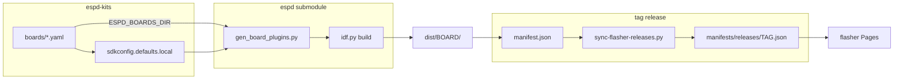

# Architecture — ESPD Kits

## Goals

1. **Single place** for board/plugin YAML presets (Waveshare, future kits, optional “profiles”).
2. **Reproducible binaries** per board × ESP-IDF target, published on GitHub Releases.
3. **Browser flashing** (GitHub Pages), aligned with [ESPD Web Flasher](https://flasher.michaelkramer.at/).

## Why a separate repo (vs only `espd`)

| Concern | `espd` (core) | `espd-kits` (this repo) |
|---------|---------------|-------------------------|
| Pd port, patches, dev sync | ✓ | submodule |
| Generic I2S + board *mechanism* | ✓ | — |
| Product/board *catalog* + releases | optional | ✓ |
| Web flasher + manifest | — | ✓ |
| Submodule pins (esp-bsp branches) | example YAML | versioned per kit |

**Submodule** pins firmware SHA per kits release. Board YAMLs live **here**; the **`espd` submodule is not modified** during builds.

## Managing board files

| File | Owner | Purpose |
|------|--------|---------|
| `boards/<id>.yaml` | **espd-kits** | Sole source of truth; CI and manifests scan this directory |
| `components/espd_board_*` | **generated** | From YAML at CMake time; gitignored in espd |

**CI / local build** (ephemeral under `espd/`, not committed in the submodule):

```bash
export ESPD_BOARDS_DIR=$PWD/boards
python3 scripts/generate-manifest.py --select waveshare_s3 > espd/sdkconfig.defaults.local
cd espd && idf.py set-target esp32s3 build
```

`build-board.sh` and `build.yml` set `ESPD_BOARDS_DIR` and write `sdkconfig.defaults.local` automatically.

## Build pipeline



1. `prepare_espd.sh` — Pd patches only.
2. `build-board.sh <id>` — `ESPD_BOARDS_DIR` + `.local`, `idf.py build` in `espd/`.
3. Tag release → `manifest.json` on the release → Pages mirrors per-tag JSON for the flasher.

## Manifest (flasher)

See `scripts/generate-manifest.py` and [flasher/INTEGRATION.md](../flasher/INTEGRATION.md). Only **per-release** manifests are used at runtime (`flasher/manifests/releases/{tag}.json`). Nothing under `manifests/` is tracked in git.

## GitHub Actions

| Workflow | Trigger | Output |
|----------|---------|--------|
| `build.yml` | tags `v*`, manual | matrix from `boards/*.yaml`; `manifest.json` on release |
| `pages.yml` | push to `main` | deploy `flasher/`; mirror release firmware via `sync-flasher-releases.py` |

## Follow-ups in `espd`

Done or tracked in upstream:

- Board-neutral `sdkconfig.defaults.esp32s3`
- `sdkconfig.defaults.local` + `ESPD_BOARDS_DIR`

## Release tagging

Tag **`vX.Y.Z`** on `espd-kits`, bump **`espd` submodule** to a commit that includes the hooks above, record both SHAs in release notes.
